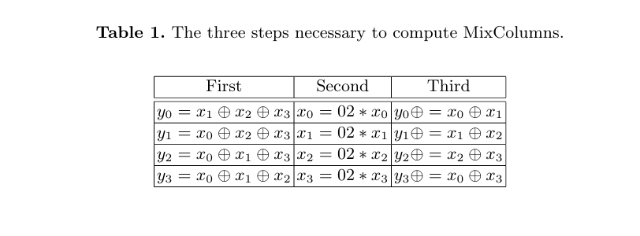

# **tfhe-aes**
---
tFHE implementation of AES

---

# **Brief Overview**

This work is an implementation of AES in multiple modes (EBC, CBC, OFB, etc) that works in FHE. Our approach follows mostly this paper [Efficient Implementation of AES in 32 bit systems](https://link.springer.com/content/pdf/10.1007/3-540-36400-5_13.pdf), namely working with transposed state matrices improved performance. Furthermore, we decided to implement AES using the `tfhe::boolean` API, as we found that the "SubBytes" operation takes too much time using standard `FHEUint` types. To improve the performance of the `SubBytes` operation, we implemented a 8-bit multiplexer in the form of a boolean tree to represent each `SBOX`, which we then reduced using basic boolean logic to have the fewest operations possible. Evaluation of this boolean tree was done in a staged manner to allow for the most parallelism. 

During our research we came across multiple other papers implementing AES using FHE, namely: 
[Leveled Functional Bootstrapping via External Product Tree]()
[At Last! A Homomorphic AES Evaluation in Less than 30 Seconds by Means of TFHE]()

which had implemented new primitives and methods that enabled faster simultaneous bootstrapping operations and yielded much faster results. However, we have not tested whether these results were achieved with the security parameters as outlined in the challenge, yet they are definitely much faster than our implementation.

---

# **In-depth Explanation**

In this explanation, we will skim over the details of AES itself, and rather focus on the different parts of our solution that are unique.

## **FHEByte**
Firstly, we can see from the AES implementation that addition and subtraction of integers as a method is not used. As such, it would make sense to implement a FHEByte that uses all 8 bits for encryption (instead of 4 for message, and 4 for carry-over). The FHEByte is a wrapper around `[tfhe::boolean; 8]`, and we have implemented the standard logical methods (such as `xor`, `and`, `not`, 'shift-left' etc.), and other methods for convenience such as instantiating as from the clear `bool` or `u8`, or encrypted ones. 

## **Boolean-tree and Multiplexer**
The sub-bytes operation is the main source of performance cost for the AES-implementation. In ordinary clear implementations, there is usually an array `SBOX` such that indexing this array would give you the substitution: `sub-word(x) = SBOX[x]`. We decided to implement this array accessing by encoding it as an 8-bit multiplexer for each bit, where the input to the multiplexer is 256 the possible bits as a result of the `sub-word` operation, and the selector bits are the current bits that make up the `FHEByte`. Performing this multiplexer operation for each bit is effectively traversing "decision tree" of sorts. As such we decided to represent the entire decision tree as a recursive `BooleanExpr` object.

We then simplified this 'BooleanExpr' using the `reduce_mux` method, which simplifies tautologies (such as mux(condition, true, true) = true) and other standard expressions. The simplification of the expressions are done in an ordered manner so that each `BooleanExpr` is uniquely hashable.

### **Staging**
This ability to uniquely hash the `BooleanExpr` is useful in the next step: staged evaluation. As there are many repeated expressions in the final `BooleanExpr`, we can simplify the evaluation by staging it (based on the height of the node), and then using a hashmap to keep a set of expressions that we have already evaluated. To further optimize the performance, the relevant `Ciphertext` objects are retrieved from the `HashMap`, and encapsulated into a `Runnable` object which `rayon` can spread among the thread pool. 

However, this optimization seems to have hit an internal bottleneck, as we observe about half the speed as it should achieve, averaging around 1.6s per byte substitution on a 16-thread machine, where the optimal performance should be <1s.

## **AES implementation**
We followed [Efficient Implementation of AES in 32 bit systems](https://link.springer.com/content/pdf/10.1007/3-540-36400-5_13.pdf) where they worked with the transpose state matrix and keys. They implement the `mix_columns` and `key_expansion` algorithms differently, and have to use fewer operations as a result. 

> 

We implemented the different modes following NIST standards [Recommendation for Block Cipher Modes of Operation](https://nvlpubs.nist.gov/nistpubs/legacy/sp/nistspecialpublication800-38a.pdf) and [FIPS 197 Advanced Encryption Standard (AES)](https://nvlpubs.nist.gov/nistpubs/FIPS/NIST.FIPS.197-upd1.pdf). We have consulted these references for the various tests in our program.

---

# **Getting Started Guide: Building and Running the Program**

This guide will walk you through **building and running** the program, explaining its required arguments and expected behavior.

---

## **1. Prerequisites**
Ensure you have the following installed on your system:
- **Rust** (latest stable version)  
  If Rust is not installed, you can install it using [Rustup](https://rustup.rs/):  
  ```sh
  curl --proto '=https' --tlsv1.2 -sSf https://sh.rustup.rs | sh
  ```
- **Cargo** (Rust’s package manager, included with Rust)  

To verify that Rust and Cargo are installed, run:
```sh
rustc --version
cargo --version
```

---

## **2. Setting Up the Project**  
Clone the repository and navigate to the project directory:  
```sh
git clone https://github.com/pjanthony2001/tfhe-aes && cd tfhe-aes  
```

---

## **3. Building the Program**
To compile the program, run:
```sh
cargo build --release
```
This will generate an optimized executable in the `target/release` directory.


---

## **4. Running the Program**
The program requires several command-line arguments. Use the following format:
```sh
cargo run --release -- [OPTIONS]
```
Or, if you built the project:
```sh
./target/release/<program-name> [OPTIONS]
```

### **Available Arguments**
| Argument                     | Short | Description |
|------------------------------|:-----:|-------------|
| `--number-of-outputs <u8>`   | `-n`  | Number of random test blocks to generate (default: `1`). |
| `--iv <hex-string>`          | `-i`  | 16-byte Initialization Vector (IV) in hexadecimal format. |
| `--key <hex-string>`         | `-k`  | 16-byte encryption key in hexadecimal format. |
| `--key-expansion-offline`    | `-x`  | Enable offline key expansion (default: `false`). |
| `--mode <ECB|CBC|CTR|OFB>`   | `-m`  | Encryption mode (default: `CTR`). |

---

## **5. Example Usage**
### **Basic Example**
```sh
cargo run --release -- -i "00112233445566778899AABBCCDDEEFF" -k "0F1571C947D9E8590CB7ADD6AF7F6798"
```
This runs the program with:
- IV: `00112233445566778899AABBCCDDEEFF`
- Key: `0F1571C947D9E8590CB7ADD6AF7F6798`
- Default mode: `CTR`
- Default output count: `1`

### **Specifying a Mode and Multiple Outputs**
```sh
cargo run --release -- -n 5 -i "00112233445566778899AABBCCDDEEFF" -k "0F1571C947D9E8590CB7ADD6AF7F6798" -m ECB
```
This runs the program with:
- 5 random output blocks
- IV and key specified in hex
- **ECB mode** instead of default `CTR`

### **Enabling Key Expansion Offline**
```sh
cargo run --release -- -i "00112233445566778899AABBCCDDEEFF" -k "0F1571C947D9E8590CB7ADD6AF7F6798" -x
```
This enables **offline key expansion**.

---
